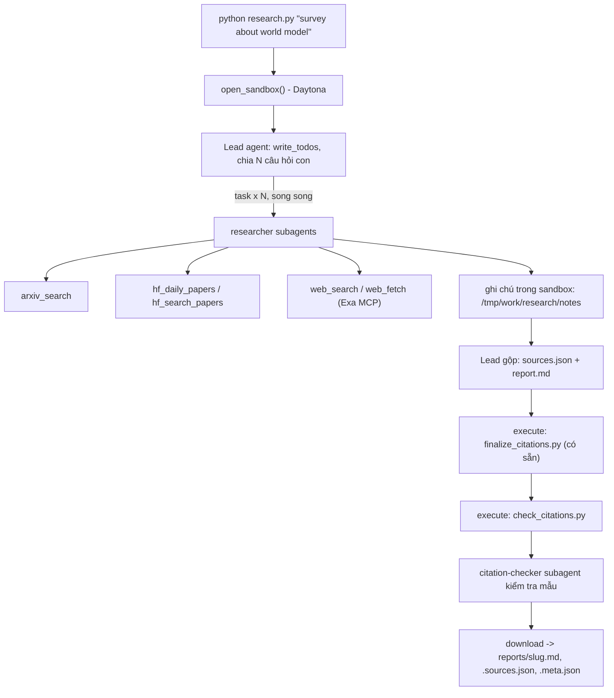

# Deep Research Agent (Deep Agents + Sandbox)

Lab dựng một **hệ thống deep research đa tác tử**: người dùng chỉ cần nhập một chủ đề (ví dụ `survey about world model`), hệ thống tự lập kế hoạch, giao việc cho nhiều subagent, tìm tài liệu trên arXiv, Hugging Face và web, rồi viết một **báo cáo có trích dẫn**.

Hình thức: **bài thực hành cá nhân**. Ngôn ngữ lập trình: Python 3.11 trở lên.

## Current validation status

The implementation passes 30 offline tests. All five English surveys pass citation,
structure, source-metadata, and citation-audit checks. `self_check.py` reports all
five topics and the Git/secret checks as successful.

The agents survey required a deterministic citation-only repair. A reviewed URL
mapping corrected 17 citation groups and added three retrieved sources. The repair,
reference finalization, audit-number synchronization, and validation ran inside the
sandbox before download. The lead-generated prose, original checker verdicts, and
supporting evidence were preserved. This repair used zero LLM calls. Its provenance
is recorded in the report metadata; the original files remain in `reports_failed/`.
The provided `model.py`, `sandbox.py`, `self_check.py`, and `finalize_citations.py`
remain unchanged. No research report was edited manually.

To reproduce the citation-only repair without calling an LLM:

```powershell
python repair_citations.py repair_plans/agents.json reports_failed/survey-about-llm-agents-and-tool-use
python self_check.py
```

This command retrieves source pages through Exa on the host and uses the configured
sandbox. The repair plan changes numbered citations only; it cannot rewrite prose.

## Chạy bản triển khai này trên Windows

```powershell
.\.venv\Scripts\Activate.ps1
python -m pip install -r requirements.txt
python -m unittest -v test_lab
python tools.py
$env:LAB_MODEL = "openai:gpt-5.4-mini"
$env:LAB_TEMPERATURE = ""
$env:LAB_REASONING_EFFORT = "low"
$env:LAB_USE_RESPONSES_API = "1"
python research.py "survey about world model"
python research.py "survey about reinforcement learning for LLM reasoning"
python research.py "survey about LLM agents and tool use"
python research.py "survey about video and multimodal generation"
python research.py "survey about efficient inference and small language models"
python self_check.py
```

Điền cấu hình của bạn vào `.env` theo `.env.example`. Mặc định dùng Daytona; đặt
`SANDBOX=docker` nếu dùng Docker cục bộ. Không đưa `.env` lên Git.
Các biến PowerShell trên chọn model và mức suy luận cho phiên terminal hiện tại;
không sửa `.env`. Có thể dùng model khác hỗ trợ tool calling theo cấu hình của bạn.

`test_lab.py` kiểm tra offline các quy tắc trích dẫn, retry, chuẩn hóa dữ liệu,
che khóa, slug và lưu kết quả. Không gọi mạng hoặc tiêu token.

Trong `reports/`, mỗi chủ đề có ba tệp cùng tên gốc: `.md` là báo cáo tiếng Anh,
`.sources.json` là nguồn đã đối chiếu trích dẫn, `.meta.json` là thống kê lần chạy
và kết quả kiểm tra mẫu khi có. Bộ đếm token chỉ bao gồm lead, không phải tổng
chi phí toàn hệ thống. Báo cáo và nguồn được lưu nguyên bytes tải từ sandbox;
finalizer và validator đều chạy trong sandbox trước khi tải về.
`validate_audit.py` yêu cầu ba verdict `SUPPORTED` của citation-checker cho đúng
câu trong báo cáo và ba URL nguồn cuối khác nhau. Audit JSON được lưu trong metadata.

Lead được giới hạn 150 lần gọi model và 300 lần gọi tool; researcher được giới hạn
40/60, citation-checker 20/30; graph của lead có `recursion_limit=1000`.
Các lỗi kết nối, timeout, 429 và 5xx của model được retry tối đa 3 lần với backoff.
Với OpenAI, mỗi yêu cầu có timeout 90 giây. Nếu kiểm tra cuối chưa đạt, lead có
tối đa 2 lượt sửa trong cùng sandbox; mỗi lượt vẫn có các giới hạn trên.
Lần chạy lỗi trả mã 1 và không lưu bộ báo cáo thiếu hoặc trích dẫn hỏng.

## 1. Mục tiêu học tập

Sau lab, bạn có thể:

1. Dựng agent bằng thư viện Deep Agents (LangChain): công cụ (tool), system prompt, subagent, backend.
2. Dùng **sandbox** (Daytona) làm không gian làm việc và nơi chạy mã cho agent; hiểu vì sao khóa API và công cụ mạng phải nằm ở phía host chứ không nằm trong sandbox.
3. Viết công cụ gọi API ngoài **chịu được giới hạn tốc độ** (retry, backoff, jitter, `Retry-After`).
4. Thiết kế quy trình đa tác tử: lead chia nhỏ câu hỏi, giao cho N researcher chạy song song, tổng hợp và kiểm tra trích dẫn.
5. Tạo báo cáo có thể kiểm chứng: mọi khẳng định có `[n]` trỏ tới một nguồn có thật.

## 2. Hệ thống làm gì



Nguồn dữ liệu:

| Nguồn | Dùng để |
|---|---|
| arXiv API `https://export.arxiv.org/api/query` | Tìm bài theo từ khóa, sắp theo ngày |
| Hugging Face Daily Papers `/api/daily_papers` | Bài đang "trending": upvotes, githubRepo, summary |
| Hugging Face papers search `/api/papers/search?q=` | Tìm bài theo chủ đề |
| Web qua Exa MCP (`web_search_exa`, `web_fetch_exa`) | Blog, survey, trang dự án, nội dung đầy đủ của một URL |

## 3. Cấu trúc thư mục

```
Lab/
├── README.md  GUIDE.md  RUBRIC.md  REPORT_TEMPLATE.md   tài liệu
├── topics.md                 5 chủ đề cần chạy
├── requirements.txt  .env.example  .gitignore
├── model.py                  CÓ SẴN - không sửa: tạo mô hình LLM từ biến môi trường
├── sandbox.py                CÓ SẴN - không sửa: sandbox Daytona (hoặc Docker), upload, download
├── self_check.py             CÓ SẴN - không sửa: tự kiểm tra trước khi nộp (python self_check.py)
├── finalize_citations.py     CÓ SẴN - không sửa: script chạy trong sandbox, tự sinh `## References` và đánh số lại trích dẫn
├── tools.py                  SINH VIÊN CÀI ĐẶT: retry + 5 công cụ nguồn dữ liệu
├── agents.py                 SINH VIÊN CÀI ĐẶT: prompt, subagent, lead agent
├── research.py               SINH VIÊN CÀI ĐẶT: script chính
├── check_citations.py        SINH VIÊN CÀI ĐẶT: kiểm tra trích dẫn, chạy TRONG sandbox
└── reports/                  báo cáo sinh ra (bạn commit vào repo nộp)
```

Các tệp "SINH VIÊN CÀI ĐẶT" đã được triển khai theo hợp đồng trong `GUIDE.md`.

## 4. Cài đặt

```bash
python3 -m venv .venv && source .venv/bin/activate      # Python 3.11+
pip install -r requirements.txt
cp .env.example .env                                     # rồi điền khóa CỦA BẠN
```

Bạn cần ba loại khóa (điền vào `.env`, **không bao giờ commit** `.env`):

| Khóa | Lấy ở đâu | Ghi chú |
|---|---|---|
| LLM (`LAB_MODEL` + khóa nhà cung cấp) | Nhà cung cấp bạn chọn (OpenAI, Anthropic, Google, OpenRouter, Ollama...) | Mô hình **phải hỗ trợ tool calling**. Chép tên mô hình từ tài liệu của nhà cung cấp. |
| `DAYTONA_API_KEY` | https://app.daytona.io | Kiểm tra gói miễn phí / credit hiện hành. Không có tài khoản hoặc hết credit: đặt `SANDBOX=docker` để chạy sandbox trong container Docker cục bộ (xem `.env.example`). |
| `EXA_API_KEY` (khuyến nghị) | https://dashboard.exa.ai/api-keys | Có thể chạy không khóa, nhưng bản miễn phí của MCP bị giới hạn tốc độ rất nhanh. |

## 5. Làm bài

Làm theo thứ tự (chi tiết trong `GUIDE.md`):

1. `check_citations.py`: khởi động nhẹ, thuần Python.
2. `tools.py`: viết `with_retry` và 5 công cụ. Thử riêng từng công cụ: `python tools.py`.
3. `agents.py`: viết prompt, subagent và lead agent.
4. `research.py`: ghép tất cả; chạy một chủ đề:

```bash
python research.py "survey about world model"
```

Kết quả nằm ở `reports/survey-about-world-model.md` cùng `.sources.json` và `.meta.json`.

## 6. Chủ đề và nộp bài

- Chạy đủ **5 chủ đề** trong [`topics.md`](topics.md), mỗi chủ đề một lần.
- Commit mã nguồn và toàn bộ `reports/`, đẩy lên một **public repo** GitHub và nộp link.
- Kiểm tra trước khi nộp: chạy **`python self_check.py`** (không tốn token): nó kiểm tra đủ 5 báo cáo, `meta.json`, trích dẫn bằng `check_citations.py` của bạn, và không có `.env`/khóa nào trong git.
- Cách chấm: xem [`RUBRIC.md`](RUBRIC.md).

## 7. Thời gian, chi phí và an toàn

Metadata được ghi nhận từ kết quả công cụ phía host. `normalize_sources.py` đối chiếu từng URL với dữ liệu này trong sandbox, rồi chạy finalizer và validator trước khi tải kết quả. URL chưa được truy xuất sẽ yêu cầu lead sửa trong sandbox; báo cáo không được sửa tay sau khi tải. Validator cũng kiểm tra cấu trúc và trích dẫn cho từng đoạn nội dung.

- Dùng một mô hình **rẻ nhưng hỗ trợ tool calling**, và **đặt giới hạn** (số lần gọi mô hình/công cụ cho lead và subagent, `recursion_limit`): một prompt hỏng có thể khiến agent lặp rất lâu. Đây là hạng mục 2.5 của `RUBRIC.md`.
- Kết quả có tính ngẫu nhiên: cùng một mã có thể cho báo cáo hợp lệ ở lần này và trích dẫn lỗi ở lần sau. Hãy sửa **prompt và mã**, không sửa tay báo cáo.

- Mỗi lần chạy tốn token LLM và thời gian sandbox. `tokens` trong `meta.json` chỉ đếm tin nhắn của lead, chưa gồm subagent, nên chi phí thật cao hơn. `open_sandbox()` luôn dừng và xóa sandbox khi kết thúc, kể cả khi lỗi. Đừng bỏ qua nó.
- **Không đưa bí mật vào sandbox.** Sandbox không ngăn được prompt injection hay việc đẩy dữ liệu ra mạng; một trang web độc hại có thể khiến agent chạy lệnh bên trong sandbox. Vì vậy mọi công cụ gọi mạng và mọi khóa ở lại phía host.
- Nội dung lấy từ web là **dữ liệu không đáng tin**: agent không được làm theo chỉ dẫn nằm trong đó.
